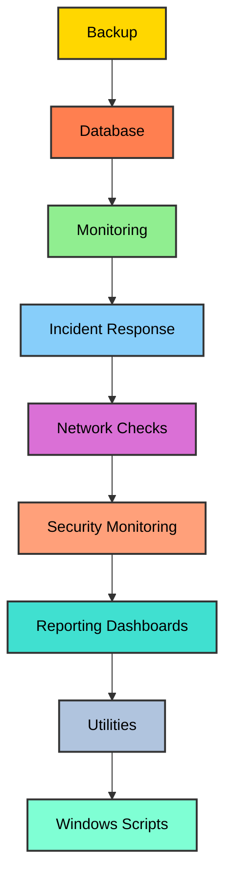
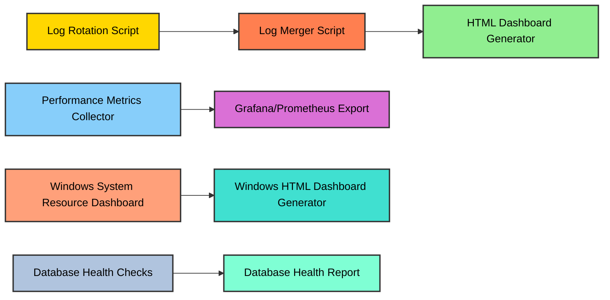

# 📊 Log‑Rotation‑Bash‑

A cross‑platform **system reliability toolkit** for automating log rotation, monitoring, incident response, and reporting using **Bash** and **PowerShell**.

---

## 🏷️ Badges


---

## 🚀 Features
- **[Log rotation](ca://s?q=Log_rotation_Bash_script)** → Automated cleanup and compression of system/application logs.  
- **[Monitoring](ca://s?q=Performance_metrics_collector_Bash_script)** → Collect CPU, memory, disk, and network metrics.  
- **[Incident tracking](ca://s?q=Service_uptime_tracker_Bash_script)** → Record uptime/downtime of critical services.  
- **[Reporting](ca://s?q=HTML_dashboard_generator_Bash_script)** → Generate dashboards and summaries in HTML, email, and text.  
- **[Cross‑platform](ca://s?q=Windows_PowerShell_monitoring_scripts)** → Includes PowerShell scripts for Windows system health.  

---

## 📂 Repository Structure (Files & Folders)
```text
Log-Rotation-Bash-/
│
├── README.md                  # Project overview
├── LICENSE                    # MIT license
├── .gitignore                 # Git ignore rules
│
├── backup/                    # Backup automation
│   └── backup_automation.sh
│
├── database/                  # Database health checks
│   └── db_health_checks.sql
│
├── docs/                      # Documentation and visuals
│   └── README_visuals.md
│
├── incident/                  # Incident response scripts
│   ├── incident_response.sh
│   ├── service_dependency_checker.sh
│   └── service_uptime_tracker.sh
│
├── monitoring/                # System monitoring
│   └── performance_metrics_collector.sh
│
├── network/                   # Network monitoring
│   ├── network_check.sh
│   └── network_latency_monitor.sh
│
├── reporting/                 # Reporting and dashboards
│   └── html_dashboard_generator.sh
│
├── samples/                   # Example outputs
│   ├── db_health_checks_example.txt
│   ├── email_notifier_example.txt
│   ├── incident_response_example.txt
│   ├── log_merger_example.txt
│   ├── scheduled_task_setup_example.txt
│   ├── system_audit_example.txt
│   └── system_dashboard_example.html
│
├── security/                  # Security monitoring
│   └── user_session_monitor.sh
│
├── utilities/                 # System utilities
│   ├── disk_space_alert.sh
│   ├── email_notifier.sh
│   ├── log_analyzer.sh
│   ├── log_archiver.sh
│   ├── log_merger.sh
│   ├── log_rotation.sh
│   └── service_restart.sh
│
└── windows/                   # PowerShell scripts for Windows
    ├── event_log_collector.ps1
    ├── html_dashboard_generator.ps1
    ├── scheduled_task_setup.ps1
    ├── system_audit.ps1
    └── system_resource_dashboard.ps1
```
## 📥 Installation
Prerequisites:
- Linux or Windows environment
- Bash shell (Linux/macOS) or PowerShell (Windows)
- SQL client (for database health checks)

Clone the repository:
```bash
git clone https://github.com/mdolawale1-cmyk/Log-Rotation-Bash-.git
cd Log-Rotation-Bash-


## ⚙️ Usage
Run scripts directly from their folders:
```bash
bash utilities/log_rotation.sh
bash monitoring/performance_metrics_collector.sh
bash reporting/html_dashboard_generator.sh
```
On Windows:
```powershell
pwsh windows/system_resource_dashboard.ps1
pwsh windows/html_dashboard_generator.ps1
```
## 📑 Samples
See the `samples/` folder for example outputs:

- [System Dashboard Report](https://github.com/mdolawale1-cmyk/Log-Rotation-Bash-/blob/main/samples/system_dashboard_example.html) → Example HTML dashboard showing system health metrics  
- [Unified Log Report](https://github.com/mdolawale1-cmyk/Log-Rotation-Bash-/blob/main/samples/log_merger_example.txt) → Combined logs from multiple sources  
- [Daily Email Summary](https://github.com/mdolawale1-cmyk/Log-Rotation-Bash-/blob/main/samples/email_notifier_example.txt) → Automated email notification with system status  
- [Incident Response Log](https://github.com/mdolawale1-cmyk/Log-Rotation-Bash-/blob/main/samples/incident_response_example.txt) → Recorded incident alerts and responses  
- [Database Health Check Report](https://github.com/mdolawale1-cmyk/Log-Rotation-Bash-/blob/main/samples/db_health_checks_example.txt) → SQL script output for database health validation  
- [Scheduled Task Setup Output](https://github.com/mdolawale1-cmyk/Log-Rotation-Bash-/blob/main/samples/scheduled_task_setup_example.txt) → Windows scheduled task creation details  
- [System Audit Report](https://github.com/mdolawale1-cmyk/Log-Rotation-Bash-/blob/main/samples/system_audit_example.txt) → Example audit of system resources and configurations  

## 📖 Documentation
For a visual overview of the repository workflow, see the **Repository Workflow Diagram**:  
[Repository Workflow Diagram](https://github.com/mdolawale1-cmyk/Log-Rotation-Bash-/blob/main/docs/README_visuals.md)

### Text‑Based Workflow Diagram
```text
+----------------+       +----------------+       +----------------+
|    Backup      | --->  |   Database     | --->  |   Monitoring   |
+----------------+       +----------------+       +----------------+
        |                        |                        |
        v                        v                        v
+----------------+       +----------------+       +----------------+
|   Incident     | --->  |   Network      | --->  |   Security     |
|   Response     |       |   Checks       |       |   Monitoring   |
+----------------+       +----------------+       +----------------+
        |                        |                        |
        v                        v                        v
+----------------+       +----------------+       +----------------+
|   Reporting    | --->  |   Utilities    | --->  |   Windows      |
|   Dashboards   |       |   Scripts      |       |   Scripts      |
+----------------+       +----------------+       +----------------+


This diagram illustrates how the different modules — Backup, Database, Incident Response, Monitoring, Network, Security, Utilities, Windows, and Reporting — connect together to form a complete reliability toolkit.
```
## Mermaid Workflow Diagram



## 🔮 Future Enhancements
Planned improvements to extend functionality and integration:

- **Slack Alerts Integration** → Send real‑time incident notifications to Slack or Microsoft Teams channels.  
- **Grafana & Prometheus Dashboards** → Connect monitoring scripts to Grafana/Prometheus for advanced visualization and metrics tracking.  
- **Cross‑Platform Monitoring Expansion** → Extend support for both Linux and Windows environments, with additional scripts for macOS.  

## 🤝 Contributing
We welcome contributions that improve functionality, documentation, or examples.  
To contribute:

1. **Fork the repository** and create your own copy.  
2. **Create a feature branch** for your changes (`git checkout -b feature-name`).  
3. **Commit your updates** with clear messages.  
4. **Push to your branch** and open a pull request.  

For significant changes, please open an issue first to discuss your ideas.  
Make sure your code follows existing style conventions and includes relevant tests or sample outputs.

## 🧾 License
This project is licensed under the MIT License — see the [LICENSE](LICENSE) file for details.

## 🙏 Acknowledgments
- Inspired by Linux system reliability practices.  
- Uses standard Bash and PowerShell utilities.  
- Thanks to open‑source contributors for monitoring and automation ideas.

